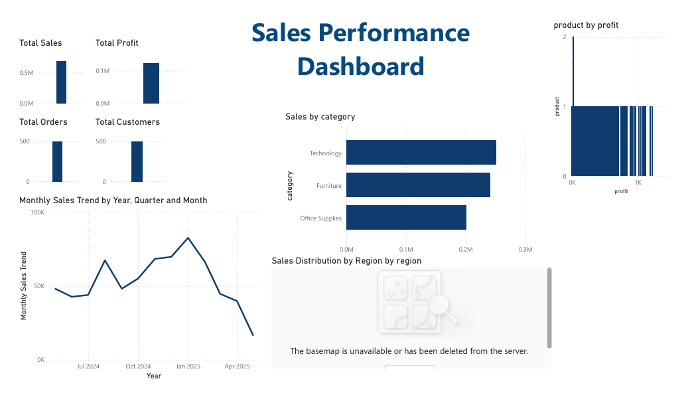
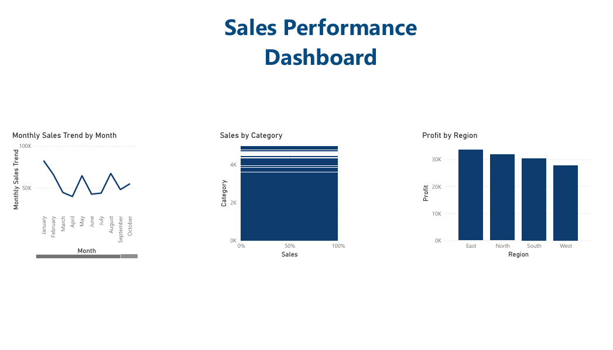

# Sales Performance Dashboard Project

## 📊 Project Summary
This interactive Power BI dashboard provides insights into sales performance across regions, product categories, and time periods. It helps identify profitable areas and trends, aiding business decisions.

## 📁 Dataset Overview
- **Columns**: order_id, customer_id, region, category, product, quantity, price_per_unit, sales, profit, order_date
- **Source**: Simulated sales data (imported via MySQL)

## ✅ Key Features
- KPIs: Total Sales, Total Profit, Total Orders
- Region-wise Sales and Profit Analysis
- Category Performance Visuals
- Trend Analysis (Sales Over Time)
- Interactive Filters (Region, Category, Date)
- Map Visualization for Regional Distribution

## 🧰 Tools Used
- **Power BI** for dashboard development
- **MySQL** for data storage
- **Python (Pandas)** for preprocessing and cleaning

## 📌 How to Use
1. Open the `.pbix` file in Power BI Desktop.
2. Use filters to explore performance across regions and time.
3. Hover over visuals to explore detailed insights.

## 🧠 Skills Demonstrated
- Data Cleaning and Integration
- KPI Calculation and Visualization
- Dashboard Design
- Storytelling with Data
- SQL + Power BI Workflow

---

## 📷 Dashboard Preview

---

## 📂 Project Files
- `Sales_Performance_Dashboard_By_YourName.pbix`
- `sales_data.csv`
- `README.md`
